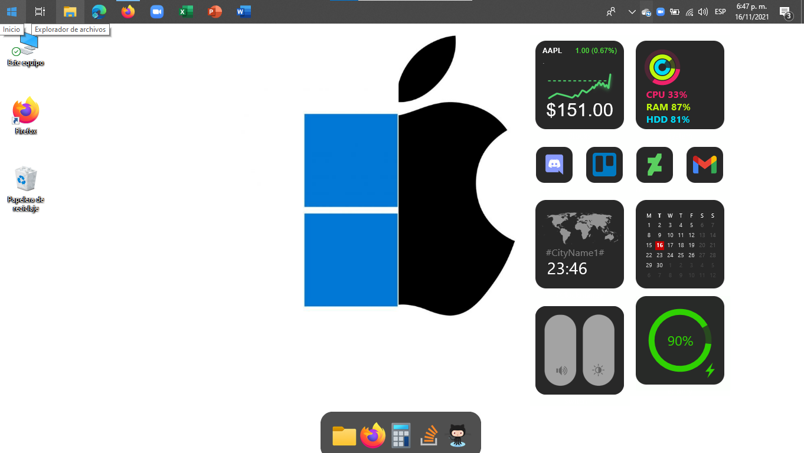

# MacDows, a mac in windows!
⚠️It requires Rainmeter to be installed for that go to:https://www.youtube.com/watch?v=3VKbOhggYVo

So, you're looking for your computer to look like macOS, so here it's MacDows.rmskin!

FINAL RESULT:

INSTALLATION:
- Install Rainmeter : https://www.rainmeter.net/
- Go to Code then click the down arrow and then click Download ZIP
- Extract it
- Then double-click the MacDows.rmskin
- Then click install 

